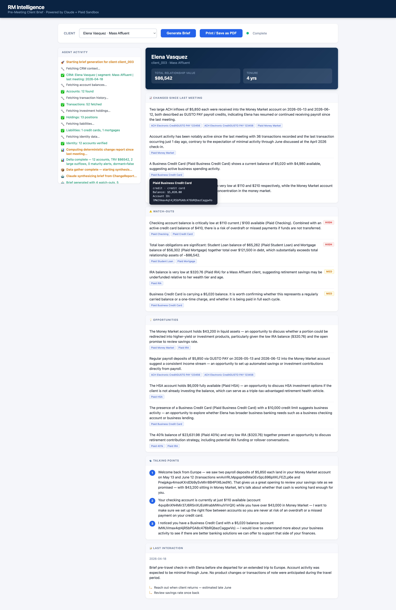

# RM Pre-Meeting Intelligence Brief

> 🎥 **Demo recording:** [youtube.com/watch?v=jKShU4F57ng](https://www.youtube.com/watch?v=jKShU4F57ng)

An **agentic AI service** that generates a one-page, fully-cited pre-meeting brief for a bank
Relationship Manager from a single client ID — in seconds. Grounded in **Plaid Sandbox** data
plus a synthetic PostgreSQL CRM. Everything runs locally via Docker Compose; the only external
calls are to Plaid Sandbox and the Anthropic API.

> **Focus areas:** Primary — *Deliver High-Value Use Cases* (Embedded Banking / Finance).
> Secondary — *Advance Agent-Based AI Capabilities* · *Operationalize GenAI (LLMOps & Quality)*.
>
> Full write-up: [`docs/problem-and-solution.md`](docs/problem-and-solution.md) ·
> cost-benefit: [`cba/cost-benefit-analysis.md`](cba/cost-benefit-analysis.md) ·
> models: [`docs/model-usage.md`](docs/model-usage.md) ·
> prompts: [`prompts/`](prompts/).



## What it does

The RM picks a client → the agent gathers data from six read-only tools → a **deterministic
Java delta engine** computes what changed since the last meeting → a **single Claude call**
writes the brief → every claim is rendered with a **clickable, validated citation**.

The brief has: snapshot, what changed since last meeting, watch-outs (with severity),
opportunities, three talking points, and a last-interaction recap.

## The design that makes it bank-grade

We split **"what is true" (deterministic) from "how to say it" (the LLM)** — the model is never
trusted with arithmetic, dates, or comparisons.

```
GET /briefs/{clientId}/stream  (Server-Sent Events)
  └── AgentOrchestrator.run()
        ├── 1. GATHER     6 read-only tools → Plaid Sandbox + synthetic CRM (Postgres)
        ├── 2. DELTA      DeltaService — pure Java, ZERO LLM tokens → ChangeReport
        ├── 3. SYNTHESIZE one claude-sonnet-4-6 call, prose strictly from the ChangeReport
        ├── 4. VALIDATE   strip any citation ID not present in the ChangeReport
        └── 5. STREAM     emit SSE events for each phase so the agent is observable
```

This gives three guarantees a bank needs: **no invented numbers**, **auditable citations**, and
**one right-sized model call per brief** (cost control). See the write-up for detail.

## Quick start

**Prerequisites:** Docker + Docker Compose. (Local non-Docker build needs JDK 21+.)

```bash
# 1. Configure secrets
cp .env.example .env
#    then edit .env and fill in:
#      ANTHROPIC_API_KEY=sk-ant-...
#      PLAID_CLIENT_ID=...
#      PLAID_SECRET=...
#      PLAID_ENV=sandbox

# 2. Start everything (builds the brief-api image from source)
docker compose up --build        # ~2–3 min first build; ~30s to healthy after

# 3. Health check
curl http://localhost:8080/health      # {"status":"UP"}

# 4. Seed the three demo clients' Plaid items (one-time, per fresh database)
curl -X POST http://localhost:8080/admin/seed-client -H "Content-Type: application/json" -d '{"clientId":"client_001","persona":"user_good"}'
curl -X POST http://localhost:8080/admin/seed-client -H "Content-Type: application/json" -d '{"clientId":"client_002","persona":"user_good"}'
curl -X POST http://localhost:8080/admin/seed-client -H "Content-Type: application/json" -d '{"clientId":"client_003","persona":"user_good"}'
```

Then open **http://localhost:8080** in a browser, pick **Robert Harrington** (the hero client),
and click **Generate Brief**.

**Approximate runtime:** a brief streams its gather/delta steps immediately and completes the
synthesized brief in a few seconds (one Claude call).

### Hero demo reset

Re-seed the hero client to a clean state before a demo:

```bash
curl -X POST http://localhost:8080/admin/seed-client \
  -H "Content-Type: application/json" \
  -d '{"clientId":"client_002","persona":"user_good","plantLargeOutflow":false,"force":true}'
```

## Endpoints

| Method | Path | Purpose |
|---|---|---|
| GET | `/clients` | List seeded clients for the UI dropdown |
| POST | `/admin/seed-client` | Bootstrap a client's Plaid item (`force:true` to re-seed) |
| GET | `/briefs/{clientId}/stream` | **SSE stream** — runs the full agent pipeline |
| POST | `/briefs/{clientId}` | Returns the stream URL (202) |
| GET | `/debug/tools/{clientId}/{tool}` | Run a single read tool, inspect raw output |
| GET | `/debug/delta/{clientId}` | Run the deterministic delta, inspect the ChangeReport |
| GET | `/health` | Liveness check |

## Demo clients (synthetic)

| ID | Name | Segment | Scenario |
|---|---|---|---|
| `client_001` | Margaret Chen | Private | Clean / baseline |
| `client_002` | **Robert Harrington** | Mass Affluent | **Hero** — CD maturing in ~3 weeks, large recurring outflow |
| `client_003` | Elena Vasquez | Mass Affluent | Dormant |

## Stack

| Layer | Technology |
|---|---|
| API | Java 21 / Spring Boot 4.0 / Maven |
| Database | PostgreSQL 16 (schema + seed via Flyway) |
| Cache | Redis 7 (wired, off by default) |
| Runtime LLM | Claude **Sonnet 4.6** via `anthropic-java` 2.41.0 |
| Financial data | Plaid Sandbox via `plaid-java` 35.0.0 |
| UI | Single static HTML/JS file (no build step) |
| Packaging | Multi-stage Docker + Docker Compose |

## Configuration

Thresholds and the agent mode live in
[`brief-api/src/main/resources/application.yml`](brief-api/src/main/resources/application.yml):

```yaml
app:
  delta:
    large-outflow-threshold: 5000   # flag outflows >= this
    dormancy-days: 90
  agent:
    eager-tool-calls: true          # false = Claude plans/sequences the tool calls (agentic mode)
```

## Hard constraints (enforced in code)

- **Read-only Plaid** — no write/transfer/payment scopes or endpoints.
- **Deterministic deltas** — `DeltaService` computes the `ChangeReport`; the LLM never does math.
- **Citation validation** — `SynthesisService.validateCitations()` strips any unresolvable ID.
- **No invented numbers** — the synthesis prompt restricts the model to the supplied data.

## Third-party components (cited per originality rules)

- [Spring Boot 4.0](https://spring.io/projects/spring-boot) (Apache-2.0)
- [`plaid-java`](https://github.com/plaid/plaid-java) 35.0.0 (MIT) — Plaid Sandbox client
- [`anthropic-java`](https://github.com/anthropics/anthropic-sdk-java) 2.41.0 (MIT) — Anthropic Messages API client
- [Flyway](https://flywaydb.org/) · PostgreSQL 16 · Redis 7
- Claude models (`claude-sonnet-4-6`) via the Anthropic API

**Data:** all data is synthetic / Plaid Sandbox. No customer PII, account data, or confidential
business data is used, committed, or sent to any external service.

**AI assistance disclosure:** this repository — code, this README, the documents under `docs/`,
and the cost-benefit analysis under `cba/` — was produced with **Claude Code**. See
[`docs/model-usage.md`](docs/model-usage.md) for the planning-vs-execution model breakdown.

## Repository layout

```
├── README.md                  # this file
├── brief-api/                 # Spring Boot service (code)
├── docs/                      # problem & solution write-up, model usage
├── cba/                       # cost-benefit analysis
├── prompts/                   # exact runtime prompts + model config
├── docker-compose.yml
└── rm-brief-spec.md           # original build spec
```

There are no unit tests — correctness is verified by running the app and hitting the endpoints
above (the `/debug/*` endpoints expose each stage in isolation).
